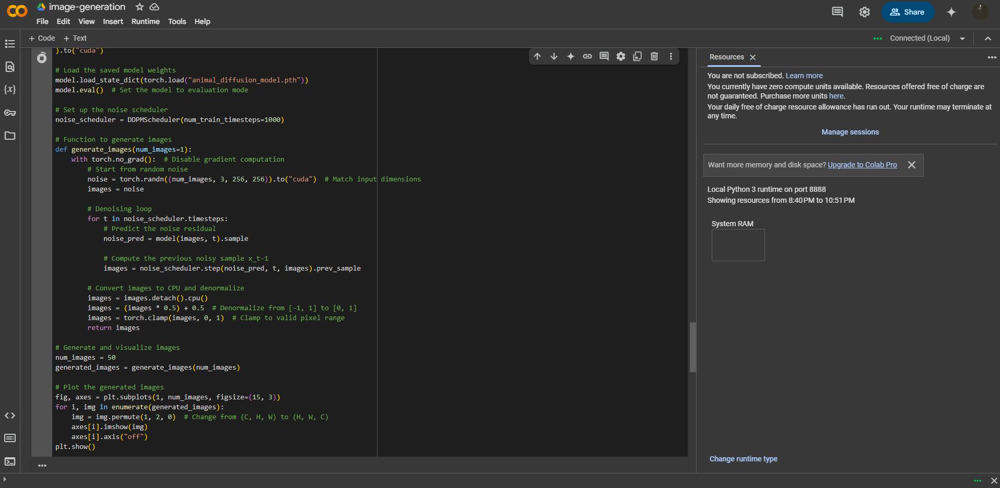

# Postcards-from-my-hell

Wasn't able to use the actual trained model of Hugging Face even after swapping to my own local runtime. (2 hours and no images generated?)

Instead of not handing in the assignment I thought it would be better to pivot to another way of generating the images.

## Strategy for training the model
> Due to the limitations presented from the original image generation w/ hugging face (running out of tokens, usable RAM, and longevity even with local hardware) I decided to use the other stable diffusion pipeline for generating the images used in this project. If the actual trained model code worked I would have trained it on a dataset called "lucabaggi/animal-wildlife" which is a repository of thousands of animals that each have their own tag depending on the animal in the photo. I reduced the image size to 16 which made the collected images extremely pixelated but still unfortunately the model still struggled with the amount of information required to train the model and generate with the model in Google Colab even with local hardware. Batch size was reduced to 16 and the number of channels for down sampling and up sampling were also reduced to 32, 64, 128, and 256 respectively to attempt at getting the model to work but still had trouble in the end. The number of epuchs were reduced to 10 to try and save time with generating images but still the model once again struggled at generating anything in the end. I would change the amount of images that I would want to generate lower and higher still the amount of time to generate just a small handful took an exuberant amount of time. 

## How I generated the fictional animals, sounds, and language
> Instead of using the trained model for generating the images used in the postcards for the assignment I decided to opt for a different method of generation instead of completely abandoning the assignment entirely. In the ipynb image generation file it is using stable-diffusion-v1-5/stable-diffusion-v1-5 to generate the deconstructed animals. To generate different animals each time I had established a pseudo-random number generator between 0 - 50 to keep the images that the model would produce different from one another. How I made the images look so distorted was through the num_inference_steps parameter keeping it low, the higher the amount of steps used usually the better the quality of the image generation but at the cost of generation time. The guidance_scale of the model actually adheres more to the prompt the more images that are actually generated with it, the prompt that I chose to use for the model is "A photograph of an imagined animal that belongs to an alien jungle. Taken from a real animal but heavily distorted until unrecognizable."

> For generating the sounds for the imagined animals I used stable audio from hugging face. Hugging face required me to login to actually generate audio for the assignment so that extra bit of code is for authentication purposes only. To create the prompt I actually first started by using ChatGPT to structure a prompt that would give me something completely alien but noticed that a lot of the sounds that were being produced from this prompt were way too similar, so I decided to create my own prompt that produced some interesting results "Create an unsettling, animalistic vocalization that is attempting to mimick human speech and intonation.
Use a mix of deep guttural resonances, insectoid chittering, bird calls, and distant mutterings. Apes in tandem yelling and screaming. Birds of paradise creating a cacophony of whails." The time for each ranged from around 25 seconds to 45 seconds to save time in the generation process. The amount of inference steps that I used for sound generation was 150.

> For the imagined animal language I just used the same process as the previous assignments with the main focus being on the structuring of the prompt for the developer role. Temperature was relatively mid to high of 1.5 and the top_p was 0.2 to keep it within the same range. The prompt I used for generating the text was the following: "Generate an alien animal language composed entirely of guttural vocalizations and sounds produced from the throat. The language should be complex enough to allow for communication of emotions, warnings, and simple commands. Consider how the species' anatomy (such as multiple vocal cords, resonating chambers, or a non-human larynx) influences the range of sounds. Provide a phonetic transcription of sample words or phrases, explanations of their meanings, and basic grammatical rules if applicable. The language should sound primal, raw, and organic—like a mix of growls, clicks, gurgles, and deep resonant hums. Generate only in the form of the sounds that these animals would make in the form of onomatopoeias. Don't explain anything just output what the sounds would sound like in written form."

## How the quality of the images and sounds could be improved
>A lot of the settings in these different models being increased or decreased would improve the quality of the sounds and images produced by them. I would say that the main thing in the image generation models would be the amount of resolution and epochs being increased would produce a way better result, increasing the num_inference_steps would also have the same result. For the sound the main thing to increase or change would be the database that you use to generate or the amount of inference steps used.
